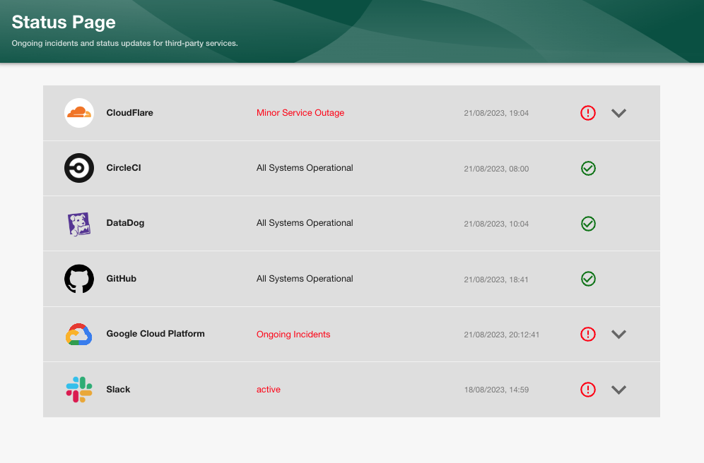
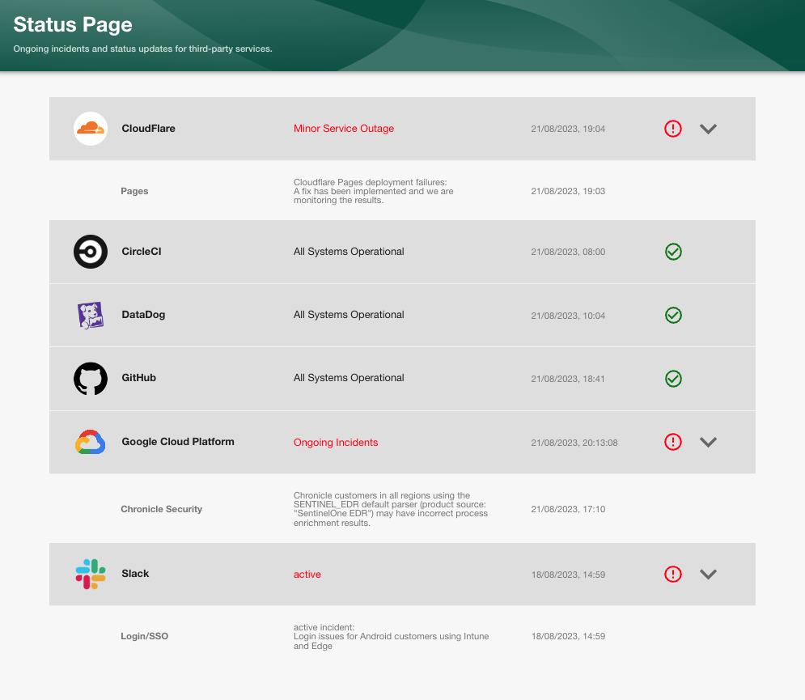

# Backstage Plugin: status-page

Welcome to the status-page plugin for [Backstage!](https://backstage.io/)

This plugin displays the status and active incidents of third party services directly in Backstage.

### Plugin Features:

- This plugin uses the third party services public status API.
- Real time display of services current status.
- If an active incident is happening the drop down will appear to display more details.
- Only the most recent incident update message is displayed.
- Links to the services full public dashboards.

 
Status page default display:

When an ongoing incident is happening, the drop down tables become available to open for more information:

## Getting started

- [Installation instructions](docs/installation.md)
